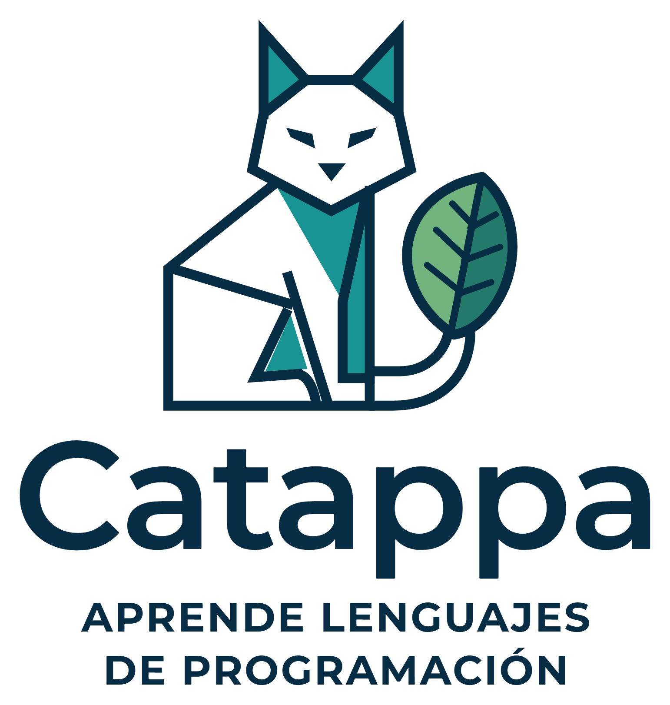

<p align="center">
  <picture>
    <source media="(prefers-color-scheme: dark)" srcset="public/marca/catappa-logo-oscuro.png">
    
  </picture>
</p>

# Catappa

Plataforma para aprender tecnología desde cero hasta nivel maestro — Linux, Git y GitHub, Docker, Kubernetes, DevOps, Jenkins, Terraform, AWS, Redes, SQL y PostgreSQL, Java, Spring Boot, Python, HTML y CSS, JavaScript, TypeScript, React, Node.js, Seguridad web, Algoritmos y estructuras de datos, Diseño de sistemas, Observabilidad, Ansible, Apache Kafka, Redis, MongoDB y Go — con lecciones
cortas estilo Duolingo, sonido, cuentas, comunidad de preguntas y respuestas,
ranking, perfiles e insignias. Se instala como aplicación (PWA) y funciona sin
conexión.

El nombre juega con **`cat` + app** (el comando de Linux) y con la
*Terminalia catappa*, el almendro tropical cuya hoja lleva **Cata**, la mascota.

---

## Arrancar

```powershell
docker compose up -d --build
```

Abre **http://localhost:8090**.

```powershell
docker compose ps          # debe decir (healthy)
docker compose logs -f     # ver qué pasa
docker compose down        # parar (los datos se conservan)
```

Los usuarios, el progreso y la comunidad viven en el volumen `catappa_catappa-datos`.
`docker compose down -v` los borraría: no lo uses salvo que quieras empezar de cero.

### Instalarla como aplicación

Es una **PWA**: en Chrome o Edge aparece el botón **Instalar la app** (barra
lateral o **Ajustes → App**) y se abre en su propia ventana, con icono. El
contenido de los cursos se guarda para usarlo **sin conexión**; las lecciones
que completes sin red se sincronizan solas al volver.

En el móvil, dentro de la misma red, la instalación y el modo sin conexión
requieren HTTPS (los navegadores solo permiten service workers en `localhost`
o en HTTPS).

### Sin Docker

Abrir `public/index.html` directamente también funciona en **modo sin conexión**:
todos los cursos y el progreso (guardado en el navegador), pero sin cuentas,
comunidad ni ranking.

---

## Cursos

| Curso | Categoría | Unidades | Lecciones | Pasos |
|---|---|---|---|---|
| Linux | Sistemas | 12 | 58 | 374 |
| Git y GitHub | Control de versiones | 7 | 38 | 279 |
| Docker | Contenedores | 10 | 54 | 443 |
| Kubernetes | Contenedores | 12 | 43 | 238 |
| DevOps | Infraestructura | 7 | 38 | 263 |
| Jenkins | Infraestructura | 11 | 47 | 294 |
| Terraform | Infraestructura | 7 | 23 | 93 |
| AWS | Cloud | 11 | 36 | 130 |
| Redes | Sistemas | 11 | 44 | 232 |
| SQL y PostgreSQL | Datos | 13 | 47 | 237 |
| Java | Lenguajes | 15 | 58 | 281 |
| Spring Boot | Backend | 13 | 50 | 222 |
| Python | Lenguajes | 11 | 40 | 151 |
| HTML y CSS | Frontend | 7 | 20 | 72 |
| JavaScript | Lenguajes | 12 | 44 | 196 |
| TypeScript | Lenguajes | 9 | 30 | 115 |
| React | Frontend | 10 | 34 | 126 |
| Node.js | Backend | 8 | 24 | 89 |
| Seguridad web | Seguridad | 7 | 25 | 92 |
| Algoritmos y estructuras de datos | Ingeniería | 10 | 26 | 97 |
| Diseño de sistemas | Ingeniería | 8 | 18 | 63 |
| Observabilidad | Infraestructura | 6 | 16 | 57 |
| Ansible | Infraestructura | 5 | 14 | 50 |
| Apache Kafka | Datos | 4 | 13 | 45 |
| Redis | Datos | 4 | 10 | 34 |
| MongoDB | Datos | 4 | 10 | 34 |
| Go | Lenguajes | 6 | 16 | 52 |
| **Total** | | **240** | **876** | **4359** |

Cada curso sube por niveles — **Fundamentos, Intermedio, Avanzado, Experto y
Maestro** — y termina con casos reales y un simulacro de entrevista. En la
portada hay **rutas de carrera** (DevOps, Backend con Java, Full stack
JavaScript, Python y automatización, Preparar entrevistas técnicas) que ordenan
los cursos recomendados. Cada curso muestra el **logo oficial** de su
tecnología; los que tratan una materia y no una herramienta (Redes, Algoritmos,
Diseño de sistemas) llevan un icono propio.

Cada lección alterna explicación y ejercicio. Tipos de ejercicio: opción
múltiple, verdadero/falso, completar con fichas, ordenar, emparejar, escribir la
respuesta y terminal simulada con salida real.

- **Intentos ilimitados, sin vidas.** Si fallas, la pregunta vuelve al final de
  la lección.
- **Corrección siempre visible** en todos los tipos de ejercicio: acierto en
  verde o error en rojo, la explicación, **tu respuesta** y la **respuesta
  correcta**. Durante medio segundo no se puede continuar, para que un doble
  clic no se la salte. En «emparejar», cada pareja errónea cuenta: con algún
  error, el ejercicio se marca como fallado y vuelve al final.
- **Sonido**: al acertar, fallar, emparejar, terminar la lección y ganar una
  insignia. Se sintetiza en el navegador (sin ficheros, funciona sin conexión).
  Se silencia desde el altavoz de la lección o en **Ajustes → Sonido**, donde
  también se ajusta el volumen.
- Las lecciones de cada curso se desbloquean en orden. Todos los cursos están
  abiertos desde el principio.

### Plataforma

- **Cuentas** con usuario y contraseña (hash scrypt). Para entrar hace falta
  cuenta: no hay modo invitado. Al registrarte se piden solo cuatro cosas —nombre,
  usuario, contraseña y su confirmación— y el progreso que hubiera en el navegador
  se importa solo.
- **Se entra con el usuario o con el correo**, si lo has añadido.
- **Correo opcional y verificado**: al añadirlo o cambiarlo llega un código de seis
  cifras y el correo no se guarda hasta confirmarlo. Sirve para **recuperar la
  contraseña** desde la pantalla de acceso. Se puede desvincular cuando quieras.
- **Perfil completo**: nombre, usuario, correo, fecha de nacimiento, sobre ti,
  color del avatar, **foto de perfil** (se recorta y reduce a 256 px en el
  navegador) y **país de origen con bandera**.
- **Borrar la cuenta**: pide la contraseña y escribir tu usuario, y se lleva el
  progreso, los certificados, los proyectos, las publicaciones, la foto y el
  correo asociado.
- **Proyectos por misiones**: cada curso tiene proyectos que aparecen dentro del
  camino, en la etapa que los desbloquea. Se hacen dentro de la plataforma, misión
  a misión, y **cada misión se comprueba de verdad**: el comando que escribes, el
  código que se ejecuta con casos de prueba, o la salida real que pegas desde tu
  máquina, validada contra patrones. Solo lo que no se puede comprobar queda como
  confirmación manual, y se marca como tal.
- **Elegir lenguaje y framework** en los cursos de infraestructura (Docker,
  Kubernetes, Jenkins, Terraform, Ansible, AWS…): los ejemplos, Dockerfiles,
  comandos de prueba, puertos y rutas de salud pasan a ser los de tu stack.
  Hay ocho: Java+Spring, Node+Express, Python+Django, Python+FastAPI, PHP+Laravel,
  Go, .NET y Ruby+Rails.
- **Comunidad**: preguntas, debates y recursos por curso y por lección; respuestas,
  votos, respuesta aceptada, búsqueda y filtros. Admite bloques de código.
- **Ranking** semanal y global.
- **Perfil** con mapa de actividad anual, progreso por curso, insignias y
  publicaciones.
- **XP, racha diaria y objetivo diario** (50 XP).
- **Tema Sistema, Claro u Oscuro.** Por defecto sigue al del sistema operativo.
  Solo con la sesión iniciada se puede cambiar (en **Ajustes → Apariencia** o en
  el menú del botón de tema de la barra superior, con las mismas tres opciones) y la elección se guarda en la cuenta; en la
  pantalla de acceso siempre se usa el del sistema. El predeterminado está en
  `F.TEMA_PREDETERMINADO` (`public/js/nucleo.js`).
- **Reiniciar un curso**: desde la página del curso o en **Ajustes → Reiniciar un
  curso**, lo deja como si nunca se hubiera empezado ni abierto (lecciones, XP,
  actividad en la racha y el ranking, unidades plegadas y, en Docker, el progreso
  del curso antiguo guardado en el navegador).
- **Contraseñas con ojo** para mostrarlas u ocultarlas en todos los campos.
- **Cata, la mascota, vive dentro de la app** (`public/js/cata.js`, vector generado
  desde el código): su **hoja cambia de color con tu nivel** en cada curso —verde
  en Fundamentos, amarilla en Intermedio, naranja en Avanzado, roja en Experto y
  dorada en Maestro—, **brilla cuando llevas racha** y cambia de expresión:
  sonríe y mueve la cola al acertar, ladea la cabeza al fallar (sin regañar),
  levanta la hoja al terminar una lección y se duerme si hace días que no entras.
  Aparece en la portada, en la página del curso, en cada corrección, al terminar
  una lección y en tu perfil.
- **Certificados**: al completar todas las lecciones de un curso se emite un
  certificado con el nombre, el curso, la fecha y un código único
  (`CAT-XXXX-XXXX-XXXX`). Se ve en `#/certificado/<código>`, donde cualquiera
  puede verificarlo sin cuenta, y se descarga como imagen PNG o como PDF. Aparece
  al terminar la última lección, en la página del curso y en el perfil; quien ya
  había completado cursos lo recibe al entrar. Reiniciar el curso lo retira.
- **Búsqueda global** con `Ctrl + K` (lecciones, unidades y conceptos clave).
- **Cerrar sesión** a un clic en la barra superior, siempre con confirmación.
- Diseño revisado en diez resoluciones, de 320×568 a 1920×1080: la ventana no se
  desplaza, lo hace el contenido, con la cabecera fija arriba y, en móvil, la
  barra de navegación abajo.

### Tu progreso anterior

El progreso del curso anterior de Docker (guardado en el navegador en
`localhost:8090`) se detecta y se importa automáticamente al entrar o al crear
la cuenta. Si estudiaste en otro navegador, en **Ajustes → Progreso anterior**
hay un botón para marcar Docker hasta la **Unidad 2 · Lección 4**.

---

## Antes de empezar con Docker

```powershell
docker --version
docker compose version
docker run hello-world    # debe imprimir "Hello from Docker!"
```

> ⚠️ Si tienes contenedores o volúmenes de otros proyectos, **no ejecutes
> `docker system prune -a --volumes` ni `docker volume prune`**: borrarían sus
> datos. Limpia siempre por nombre o con `docker compose down` en cada proyecto.

---

## Arquitectura

```
.
├── Dockerfile            node:22-alpine, usuario sin root, healthcheck
├── compose.yml           puerto 8090 -> 3000, volumen catappa-datos
├── server/
│   ├── server.js         API REST + servidor de ficheros (Node sin dependencias)
│   ├── indice.js         genera el índice ligero de cursos y la versión del service worker
│   ├── db.js             almacén JSON con escritura atómica
│   └── semilla.js        comunidad inicial (se crea una sola vez)
├── public/
│   ├── index.html
│   ├── manifest.webmanifest, sw.js, iconos/     PWA
│   ├── css/app.css       sistema de diseño (claro y oscuro)
│   ├── js/               núcleo, sonido, motor de lecciones, vistas
│   ├── marca/            logo de Catappa y Cata, la mascota (PNG sin fondo y SVG)
│   ├── iconos/, favicon.ico   favicon e iconos de la app (fondo blanco redondeado)
│   ├── logos/            logos oficiales de cada tecnología (SVG)
│   └── cursos/
│       ├── _catalogo.js  fichas de los cursos y rutas de carrera
│       ├── _indice.js    índice generado (títulos, lecciones, número de pasos)
│       └── <curso>-uN.js contenido de cada unidad
```

La portada solo descarga el índice (unos 270 KB); el contenido de cada curso se
carga al abrirlo. El servidor no tiene dependencias de npm y lee el mismo
contenido que el navegador para validar el progreso (no se puede marcar una
lección que no existe ni inflar la XP). La imagen solo lleva `server` y `public`.

**Stack actual:** Node.js sin framework, datos en ficheros JSON y JavaScript sin
framework en el navegador. Está prevista una migración a **Node.js +
PostgreSQL** en el backend y **React + TypeScript** en el frontend, conservando
todos los cursos.

### API

| Método | Ruta | |
|---|---|---|
| POST | `/api/registro`, `/api/login`, `/api/logout` | cuentas |
| GET | `/api/yo` | perfil y progreso de la sesión |
| POST | `/api/progreso` | registrar una lección terminada |
| POST | `/api/importar` | importar progreso previo |
| POST | `/api/perfil` | editar nombre, bio, color, tema, fecha de nacimiento, país, foto y stack |
| POST | `/api/correo/codigo`, `/api/correo/verificar`, `/api/correo/quitar` | correo verificado por código |
| POST | `/api/clave/olvidada`, `/api/clave/restablecer`, `/api/clave/cambiar` | contraseña |
| POST | `/api/cuenta/borrar` | borrar la cuenta (pide contraseña y usuario) |
| POST | `/api/proyecto/paso` | comprobar una misión de un proyecto |
| POST | `/api/proyecto` | entregar un proyecto (se revisan todas sus misiones) |
| POST | `/api/examen` | examen de una unidad |
| GET | `/api/lenguajes` · POST `/api/ejecutar`, `/api/ejercicio` | ejecución real de código |
| GET | `/api/perfil/:usuario` | perfil público |
| GET | `/api/ranking?rango=semana\|global` | ranking |
| GET/POST | `/api/comunidad` | listar (filtros `curso`, `leccion`, `q`, `orden`) y publicar |
| GET/DELETE | `/api/comunidad/:id` | hilo |
| POST | `/api/comunidad/:id/respuestas`, `/voto`, `/aceptar` | participar |
| POST | `/api/progreso/reiniciar` | reiniciar un curso (`{ cursoId }`); retira su certificado |
| GET | `/api/certificados/:codigo` | verificar un certificado (público) |
| GET | `/api/estado` | salud (lo usa el healthcheck) |

---

## Correo saliente

Los códigos de verificación y de recuperación se mandan con un cliente SMTP
propio (`server/correo.js`, sin dependencias). Se configura con variables de
entorno:

| Variable | |
|---|---|
| `CATAPPA_SMTP_HOST` | servidor, por ejemplo `smtp.gmail.com` |
| `CATAPPA_SMTP_PUERTO` | `465` (TLS directo) o `587` (STARTTLS). Por defecto 587 |
| `CATAPPA_SMTP_USUARIO` / `CATAPPA_SMTP_CLAVE` | credenciales (en Gmail, una contraseña de aplicación) |
| `CATAPPA_SMTP_DESDE` | remitente; por defecto, el usuario |

**Sin configurar nada funciona igual**: en ese caso el mensaje se guarda en
`datos/correos/` y el código se enseña en la propia pantalla, avisando de que es
el modo local. Así una instalación personal no se queda a medias.

---

## Añadir o cambiar lecciones

Todo el contenido está en `public/cursos/<curso>-uN.js`, en formato legible.
Cada unidad declara su `nivel` (Fundamentos, Intermedio, Avanzado, Experto o
Maestro) y cada paso es un objeto con su tipo:

```js
{t:"info",    h:"Título", c:"<p>explicación en HTML</p>"}
{t:"opcion",  p:"Pregunta", ops:["a","b","c"], ok:1, why:"por qué"}
{t:"vf",      p:"Afirmación", ok:false, why:"..."}
{t:"hueco",   p:"...", tpl:"docker ___ -d nginx", banco:["run","exec"], sol:["run"]}
{t:"escribe", p:"...", sol:["docker ps"], pista:"..."}
{t:"term",    p:"...", sol:["docker ps"], salida:"CONTAINER ID ..."}
{t:"orden",   p:"...", items:["primero","segundo","tercero"]}
{t:"par",     p:"...", pares:[["-d","segundo plano"],["-p","puertos"]]}
```

Los textos de `c`, `p`, `why`, `pista`, `ops` y `claves` se pintan como HTML:
escribe `&lt;` y `&gt;` para mostrar `<` y `>`. Los de `pares`, `items`, `tpl`,
`sol` y `salida` son texto plano. En `par`, los textos de la derecha deben ser
distintos entre sí. El `why` se muestra tanto al acertar como al fallar (si
empieza por «Exacto:» o «Correcto.», al fallar se omite esa palabra).

Para un curso nuevo: añade su ficha en `cursos/_catalogo.js` (con `logo:
"logos/<curso>.svg"` si la tecnología tiene logo, o solo `glifo` si no), sus
ficheros de unidades y, si tiene logo, el SVG en `public/logos/` y en la lista
`FICHEROS` de `public/sw.js`. Después, regenera el índice y reconstruye:

```powershell
node server/indice.js
docker compose up -d --build
```

(El `Dockerfile` también ejecuta `server/indice.js` al construir la imagen.)

---

## Marca

**Cata** es la mascota: una gata geométrica con una hoja de catappa. En la app se
dibuja en vector (`public/js/cata.js`) para poder cambiar el color de la hoja
según tu nivel y su expresión según lo que pase; para el logo y los iconos se usa
el PNG sin fondo de `public/marca/`.


**Cata**, la mascota, es una gata geométrica con una hoja de catappa. Está
redibujada en vector (`public/marca/cata.svg`) a partir del logo original, así
que todos los PNG se generan nítidos a cualquier tamaño.

| Fichero | Uso |
|---|---|
| `public/marca/catappa-logo.png` · `-oscuro.png` | logo completo con nombre y lema, sin fondo (texto navy o claro) |
| `public/marca/catappa-horizontal.png` · `-oscuro.png` | mascota y nombre en línea, para cabeceras |
| `public/marca/cata.png` (1024 px), `cata-256.png`, `cata-96.png` | Cata sin fondo, en la interfaz |
| `public/marca/cata.svg` | vector de la mascota |
| `public/iconos/icono.svg`, `favicon-32.png`, `favicon-16.png`, `public/favicon.ico` | favicon con fondo blanco redondeado |
| `public/iconos/icono-192.png`, `icono-512.png`, `icono-maskable-512.png`, `apple-touch-icon.png` | iconos de la app instalada |

**Paleta** (sale del logo):

| Color | Hex | Uso |
|---|---|---|
| Navy | `#072D44` | contornos y texto |
| Turquesa | `#179493` | acento y botones |
| Verde hoja | `#70B37D` | detalles de la hoja |
| Verde hoja oscuro | `#247A6A` | detalles de la hoja |
| Fondo claro | `#F4F7F8` | tema claro |
| Navy profundo | `#0B1821` | tema oscuro |

**Tipografía:** Montserrat SemiBold para el nombre y Geist para la interfaz. El
nombre y el logo se configuran en `public/js/nucleo.js` → `F.MARCA`.

## Créditos

Los logos de `public/logos/` proceden de [Devicon](https://devicon.dev) (licencia
MIT) y, el de OWASP, de [Simple Icons](https://simpleicons.org) (CC0). Son marcas
de sus respectivos propietarios y se usan solo para identificar cada tecnología.

## Licencia

[MIT](LICENSE) © 2026 Pablo M. Ocampos. Los logos de las tecnologías de
`public/logos/` son marcas de sus propietarios y tienen su propia licencia (ver
Créditos); la licencia MIT cubre el código, los cursos y la marca Catappa de este
repositorio.
